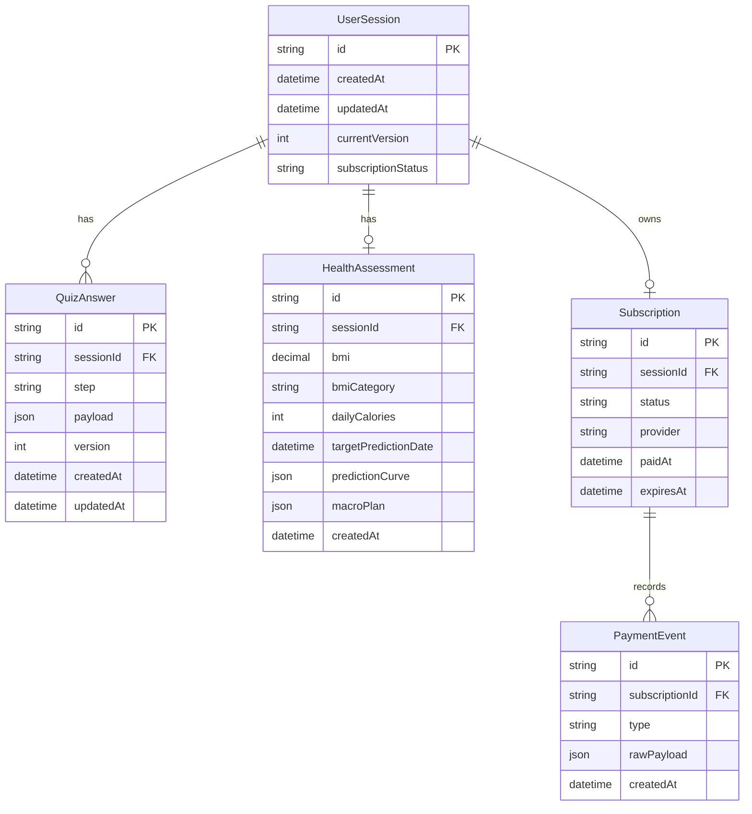

# Database Schema

## Design notes

- UserSession is the stable session identity used for anonymous funnel recovery.
- QuizAnswer stores each step separately and uses a unique (sessionId, step) constraint, which makes repeated step submissions idempotent and extensible when new quiz steps are added.
- currentVersion supports optimistic concurrency for concurrent tab updates.
- HealthAssessment is separated from raw answers so calculation history can later become versioned without changing answer storage.
- Subscription and PaymentEvent are split so access control can read a simple status while payment callbacks remain auditable.
